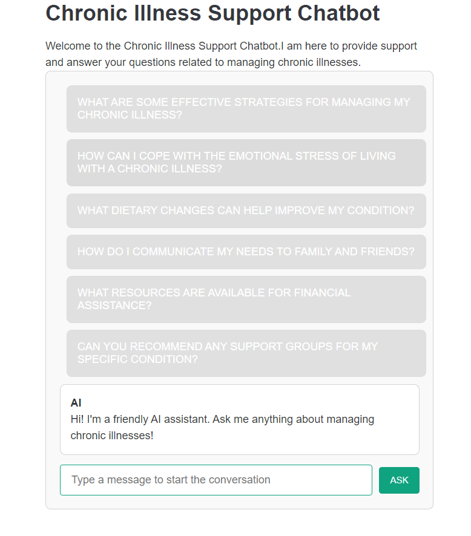

## Chronic Illness Support Chatbot

This project demonstrates how to implement a chatbot for chronic illness support using Next.js and the [OpenAI API](https://beta.openai.com/docs/api-reference/completions/create).

### Online Demo

Check out the live demo: https://chronic-illnesses-practice-hlk4.vercel.app/



### Set up Environment Variables

1. Rename the `.env.example` file to `.env.local`:

    ```bash
    cp .env.example .env.local
    ```

2. Update the `OPENAI_API_KEY` with your [OpenAI API key](https://beta.openai.com/account/api-keys):

    ```bash
    OPENAI_API_KEY=your_openai_api_key
    ```

### Development

To get started with development:

1. Install the dependencies:

    ```bash
    npm install
    ```

    or

    ```bash
    yarn
    ```

2. Run the development server:

    ```bash
    npm run dev
    ```

    or

    ```bash
    yarn dev
    ```

3. View the app at [http://localhost:3000](http://localhost:3000).

### Deployment

To deploy your chatbot on Vercel:

1. Push your project to a GitHub repository.
2. Log in to [Vercel](https://vercel.com/), connect your GitHub repository, and follow the prompts to deploy your project.
3. Vercel will handle the build and deployment process automatically.

   
